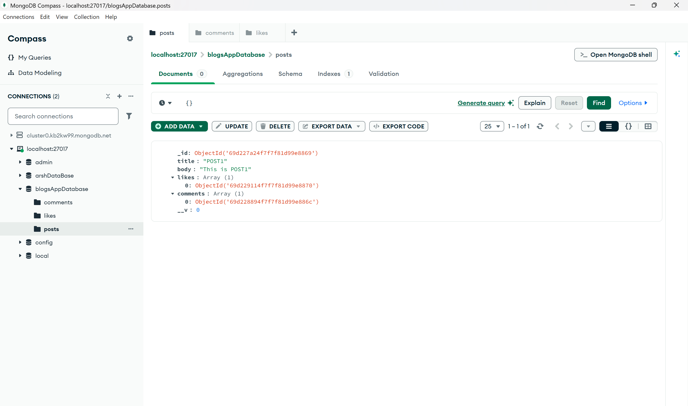
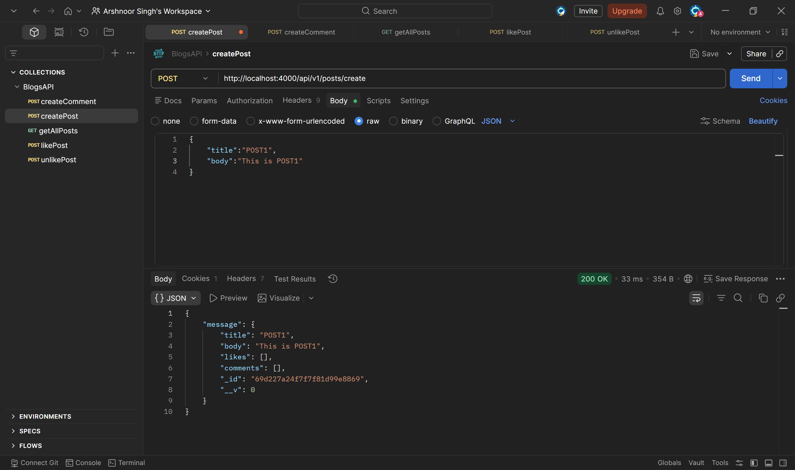
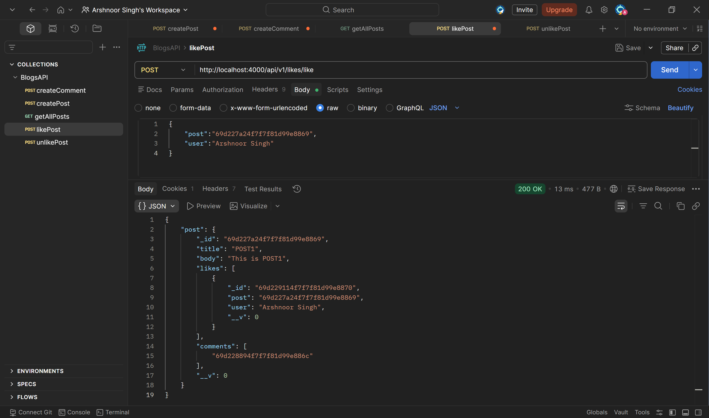
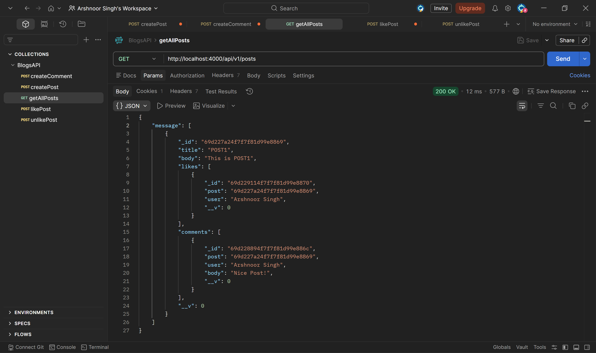

# Blog Backend API

A RESTful backend API for a blogging platform built using Node.js, Express.js, and MongoDB. The application supports core social features such as posts, comments, and likes, with proper data relationships managed using Mongoose.

---

## Overview

This project implements a scalable backend system that allows users to create posts, add comments, and like or unlike posts. It follows a modular MVC architecture and demonstrates relational data handling in a NoSQL database.

---

## Features

* Create and retrieve blog posts
* Add comments to posts
* Like and unlike posts
* Retrieve posts with associated comments and likes
* Structured using MVC architecture
* RESTful API design

---

## Tech Stack

* Node.js
* Express.js
* MongoDB
* Mongoose
* dotenv

---

## Project Structure

```bash
BLOGSAPP_BACKEND/
│
├── config/
│   └── database.js
│
├── controllers/
│   ├── commentController.js
│   ├── likeController.js
│   └── postController.js
│
├── models/
│   ├── commentModel.js
│   ├── likeModel.js
│   └── postModel.js
│
├── routes/
│   └── blog.js
│
├── .env
├── index.js
├── package.json
├── README.md
```

---

## Installation and Setup

### Clone the repository

```bash
git clone https://github.com/Arshnoor07/blog-backend-api.git
cd blog-backend-api
```

### Install dependencies

```bash
npm install
```

### Configure environment variables

Create a `.env` file in the root directory:

```env
PORT=3000
DATABASE_URL=your_mongodb_connection_string
```

### Run the server

```bash
npm start
```

The server will run at:

```
http://localhost:3000
```

---

## API Endpoints

### Post Routes

| Method | Endpoint             | Description       |
| ------ | -------------------- | ----------------- |
| POST   | /api/v1/posts/create | Create a new post |
| GET    | /api/v1/posts        | Get all posts     |

### Comment Routes

| Method | Endpoint                | Description             |
| ------ | ----------------------- | ----------------------- |
| POST   | /api/v1/comments/create | Add a comment to a post |

### Like Routes

| Method | Endpoint             | Description   |
| ------ | -------------------- | ------------- |
| POST   | /api/v1/likes/like   | Like a post   |
| POST   | /api/v1/likes/unlike | Unlike a post |

---

## Data Modeling

* A Post contains references to multiple comments and likes
* A Comment references a single post
* A Like references a single post

This structure enables efficient querying and population of related data using Mongoose.

---

## Example Request

### Create Post

```json
{
  "title": "First Blog",
  "body": "This is my first blog post"
}
```

### Add Comment

```json
{
  "post": "POST_ID",
  "user": "John Doe",
  "body": "Great post!"
}
```

### Like Post

```json
{
  "post": "POST_ID",
  "user": "John Doe"
}
```
---

## Screenshots

### Database (MongoDB)

The following screenshot shows the structure of stored blog data, including relationships between posts, comments, and likes.



---

### API Testing (Postman)

#### Create Post


#### Add Comment



#### Like Post



#### Get All Posts (with populated comments and likes)



---

## Future Improvements

* Add user authentication and authorization
* Implement pagination and filtering
* Add input validation and centralized error handling
* Deploy to a cloud platform
* Integrate with a frontend application

---

## Author

Arshnoor Singh
